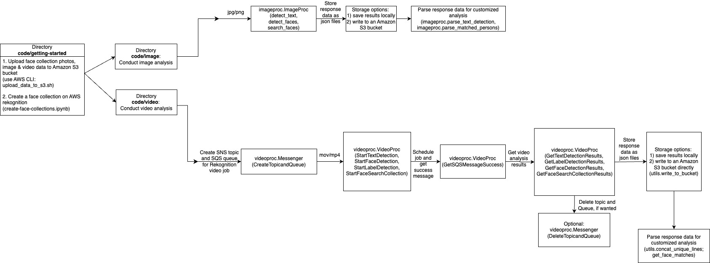

# aws-rekognition-image-video-analysis

## Overview
This repository contains scripts for performing image and video recognition and analysis through the Amazon Rekognition service (AWS SDK for Python). The core functionalities include:

- A video processing module calling the Amazon Rekognition video API to perform text detection, label detection, face detection and face search (searching for faces that match an existing face collection) on video data. The module also provides functions to create [Simple Notification Service](https://docs.aws.amazon.com/sns/latest/dg/welcome.html) (SNS) topic and [Simple Queue Service](https://docs.aws.amazon.com/AWSSimpleQueueService/latest/SQSDeveloperGuide/welcome.html) (SQS) queue necessary for Rekognition video analysis.
- An image processing module calling the Amazon Rekognition image API to perform text detection, face detection, and face search on image data.
- Code for creating a face collection with Rekognition, which is necessary to run face search for both image and video processing.
- Tutorial notebooks to use the above modules and functions. 

For background information, please consult the workflow description of [Amazon Rekognition image and video pipelines](https://github.com/aws-samples/amazon-rekognition-serverless-large-scale-image-and-video-processing/blob/main/README.md) by AWS. 

## Prerequisites
You will need to register for an AWS account. Once you registered your account, proceed as follows:

1. Create an Amazon S3 bucket to store the video and image data for processing via your AWS account ([instructions to create an Amazon S3 bucket](https://docs.aws.amazon.com/AmazonS3/latest/userguide/create-bucket-overview.html)).
2. Create your [IAM role](https://docs.aws.amazon.com/IAM/latest/UserGuide/id_roles.html) following [this instruction](https://docs.aws.amazon.com/IAM/latest/UserGuide/id_roles_create_for-user.html).
3. Configure your [AWS credentials](https://docs.aws.amazon.com/cli/latest/userguide/cli-chap-configure.html) in the environment where you will run the image and video analysis using your *access key* and *secret access key* (create your access keys first following [this instruction](https://docs.aws.amazon.com/IAM/latest/UserGuide/id_credentials_access-keys.html).

## Module structure

